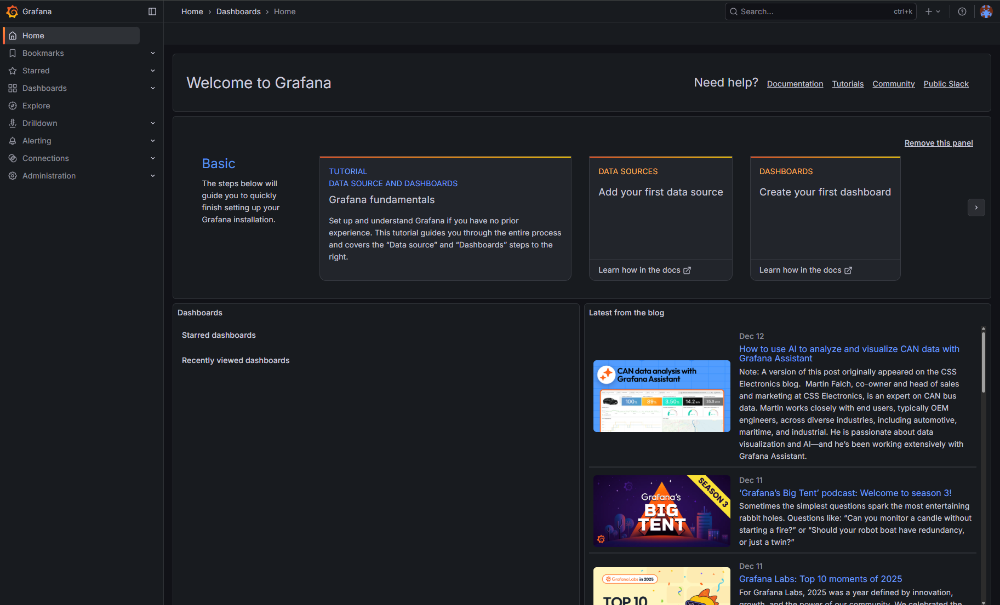
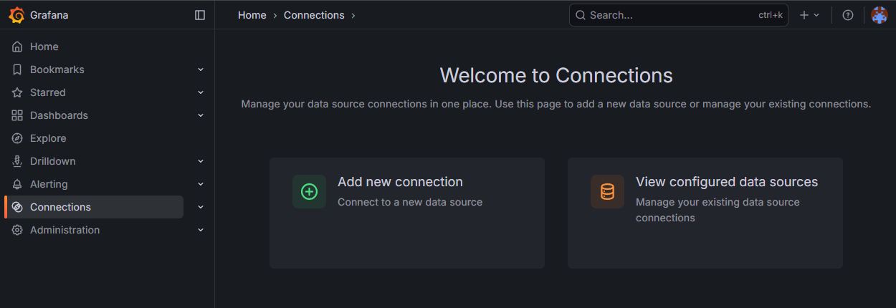
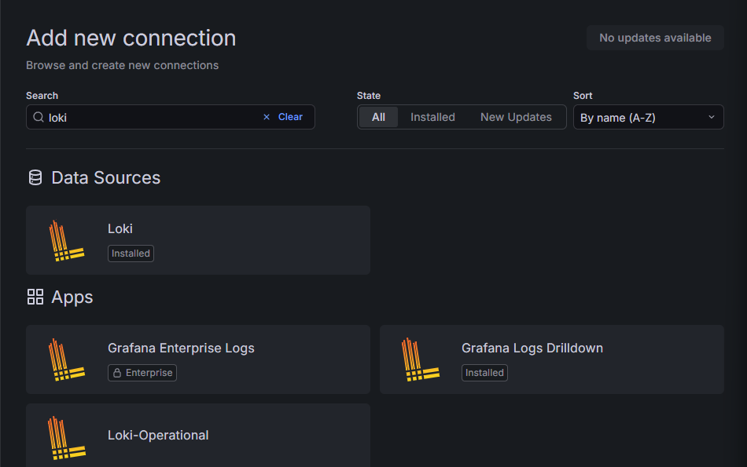
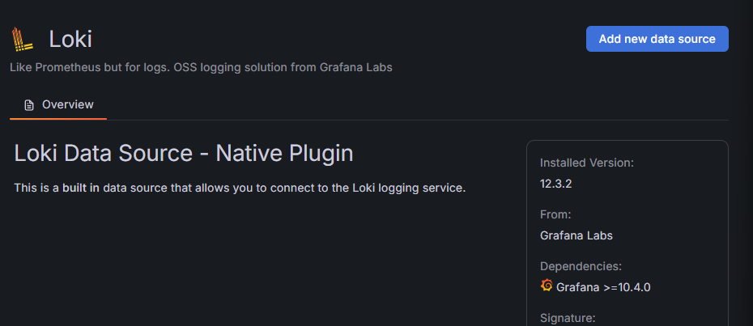
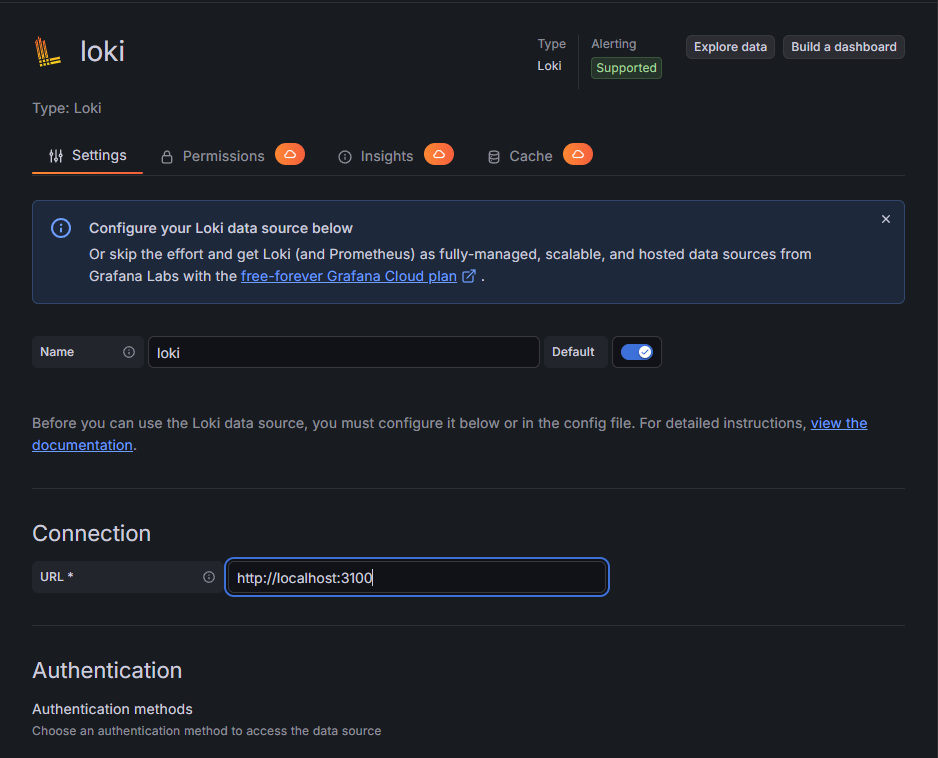
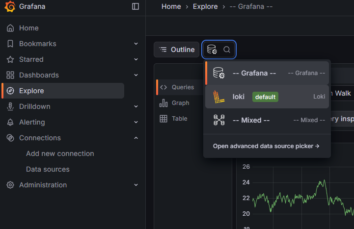
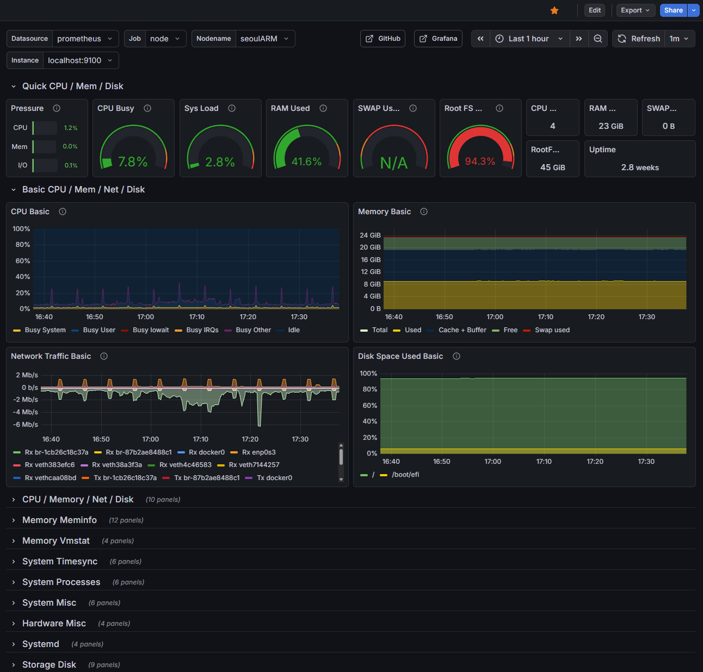

# Grafana로 서버 관측성 향상하기

월간 유저가 4천명 정도 되니, 서버 이곳저곳에 나뉘어있는 로그를 참고하기 힘들어졌다. nginx로그와 pm2로그, jenkins 빌드로그, node.js 로그가 서로 다른 곳에 발생하고 있는데, 실행 중 오류나 디버깅하고싶은 부분도 찾기가 어려운 문제들이 있었다. 따라서, Grafana를 서버 내에 구축하고, 로그를 모아 관측성을 향상하려고 한다.

## 용어
- Grafana: 웹 기반 모니터링 도구
- Loki: Grafana와 통합된 로그 검색 모듈 - Prometheus 메트릭과 Loki 로그를 함께 분석할 수 있다.
    - 메타데이터 기반으로 로그를 검색한다. 설정이 간단하고, ElasticSearch보다 빠르지만, 인덱스가 많아지면 느려질 수 있다.
- Promtail: 로그 수집 도구 - 프로그램에서 발생한 데이터, 로그를 수집해서 Loki에 push한다.
    - 최근에는 Grafana Alloy라는 것으로 대체하려고 하는 것 같다.

## 준비
셋업에 앞서, 현재 운영중인 백엔드 서버의 로깅 방식을 jsonl로 변경하고, logger 클래스를 만들어서 로깅 방식을 통일했다. (기존에는 디버깅을 위해 작성했는데, 평문으로 작성되고 있었다.)

```jsonl

{"timestamp":"2026-02-03T00:30:07.877Z","level":"INFO","category":"api","message":"SeoulAPI 성공","lineCode":"3","lineName":"3호선","trainCount":47}
{"timestamp":"2026-02-03T00:30:07.877Z","level":"INFO","category":"api","message":"SeoulAPI fallback 성공","lineCode":"3","addedFromSeoulAPI":0,"totalTrains":44}
{"timestamp":"2026-02-03T00:30:07.887Z","level":"INFO","category":"api","message":"SeoulAPI 성공","lineCode":"UI","lineName":"우이신설선","trainCount":19}
{"timestamp":"2026-02-03T00:30:07.887Z","level":"DEBUG","category":"train","message":"행선지 변경 무시 (UI/SeoulAPI)","line":"UI","trainNum":1114,"scheduledDst":"신설동","source":"SeoulAPI"}
```

하루에 로그가 90MB정도로 꽤 많은 양이 쌓이게 되는 문제도 있었는데, Loki를 사용해서 데이터를 압축한다면 주기적으로 로그를 지워주는 수고도 덜 수 있겠다.

## Loki, Grafana, Grafana Alloy 설치
현재 서비스는 Oracle의 ARM 인스턴스 하나에서 모두 제공하고 있고, 일부 데이터는 MSA중 하나인 오브젝트 버킷 등을 사용하고 있다. 현재 인스턴스를 늘리는 등의 계획은 없으므로, 같은 인스턴스 안에서 전부 설치하기로 하였다.

일반적으로는 Docker 컨테이너를 통해서 각 서비스를 서비스하지만, 현재 파일시스템에 공간이 얼마 없기도 하고, 나는 기존에 pm2를 사용해서 각종 데몬 프로세스들을 관리하고 있었으므로, pm2를 사용해서 loki와 alloy를 실행하기로 했다. Grafana는 service를 제공하므로 systemd에서 관리한다.

[Grafana Install (grafana.com)](https://grafana.com/docs/grafana/latest/setup-grafana/installation/debian/)

```bash
sudo apt-get install -y apt-transport-https wget gpg
sudo mkdir -p /etc/apt/keyrings/
wget -q -O - https://apt.grafana.com/gpg.key | gpg --dearmor | sudo tee /etc/apt/keyrings/grafana.gpg > /dev/null
echo "deb [signed-by=/etc/apt/keyrings/grafana.gpg] https://apt.grafana.com stable main" | sudo tee -a /etc/apt/sources.list.d/grafana.list
# Updates the list of available packages
sudo apt-get update
# Installs the latest OSS release:
sudo apt-get install grafana loki alloy -y
```

alloy, loki, grafana 설정은 서버에 따라 다르므로 LLM 도움을 받아 해결할 수 있다.
nginx 로깅을 간단하게 하는 경우:
```
loki.process "nginx_process" {
  forward_to = [loki.write.local_loki.receiver]

  // Nginx Combined Log Format 정규식 파싱
  stage.regex {
    // 112.156... - - [05/Feb/2026:17:14:18 +0900] "GET /path..." 200 63059 "-" "Dart..."
    expression = "^(?P<ip>\\S+) \\S+ \\S+ \\[(?P<time_local>[^\\]]+)\\] \"(?P<method>\\S+) (?P<request_url>\\S+) \\S+\" (?P<status>\\d+) (?P<bytes_sent>\\d+) \"(?P<referer>[^\"]*)\" \"(?P<user_agent>[^\"]*)\"?"
  }

  // Nginx 로그 시간 포맷 (05/Feb/2026:17:14:18 +0900) 파싱
  stage.timestamp {
    source = "time_local"
    format = "02/Jan/2006:15:04:05 -0700"
  }

  // 레이블 지정 (주의: IP나 URL은 레이블로 넣으면 안됨!)
  stage.labels {
    values = {
      method = "method",
      status = "status",
    }
  }
}
```
alloy가 go로 쓰여진 언어인 탓에, format이 `"02/Jan/2006:15:04:05 -0700"`인데, (01/02 03:04:05 06년 -0700 인가 하는 데에서 왔다고 한다) Go로 개발할 때에는 볼 일이 없지만, 내부적으로는 해당 텍스트를 format으로써 다루도록 작동되어서, 설정 파일에서 다음과 같이 적어서 내부 라이브러리에서 해당 파서를 사용하도록 설정하게 하는 것 같다.

설정이 완료되면 `systemctl`을 사용해서 현재 상태를 확인할 수 있다.
`systemctl status alloy`
`systemctl status loki`

현재 상황에 맞추어서 grafana.ini를 수정하고, (nginx reverse proxy를 사용하고 커스텀 도메인을 사용하는 데에는 설정이 필요하다.) 해당 도메인으로 접속하고 아이디를 만들면 홈 화면까지 진행할 수 있다.



## Loki와 연결하기

좌측 사이드바의 Connections를 누르고, `Add new connection`을 선택한다.



Loki를 선택한다.



오른쪽 상단의 파란 `Add new data source`를 누르고, Loki의 API URL을 입력한다.




가장 하단의 `Save & test`를 눌러 연결을 확인한다.


다음, 사이드 메뉴에서 Explore 탭으로 들어가 Loki를 확인하고, 쿼리를 만들어 데이터가 제대로 수신되는지 확인할 수 있다.




## Prometheus로 시스템 메트릭 모니터링하기

```bash
sudo apt-get install -y prometheus
sudo systemctl enable --now prometheus
sudo systemctl status prometheus
```

Loki 추가하는 것과 같이 Connections에서 추가하면 사이드 메뉴의 DrillDown의 Metrics에서 Prometheus로부터 오는 데이터를 확인할 수 있다.

다른 사용자가 만든 대시보드를 가져와서 Prometheus에서 사용할 수 있다. Alloy config(`/etc/alloy/config.alloy`)에 다음 내용을 추가하고,
```

prometheus.exporter.unix "node_exporter" {
  include_exporter_metrics = true
}

prometheus.scrape "linux_metrics" {
  targets = prometheus.exporter.unix.node_exporter.targets
  forward_to = [prometheus.remote_write.local_prometheus.receiver]
}

prometheus.remote_write "local_prometheus" {
  endpoint {
    url = "http://localhost:9090/api/v1/write"
    // Prometheus가 LISTEN 중인 주소
  }
}
```
Alloy 재시작 후
```bash 
sudo systemctl restart alloy
```

대시보드에서 New, Import하고, URL로 로드할 수 있는 입력창에 `1680`을 입력하고 Load하면 다음과 같은 화면을 볼 수 있다.



#Grafana #Loki #Alloy #Prometheus