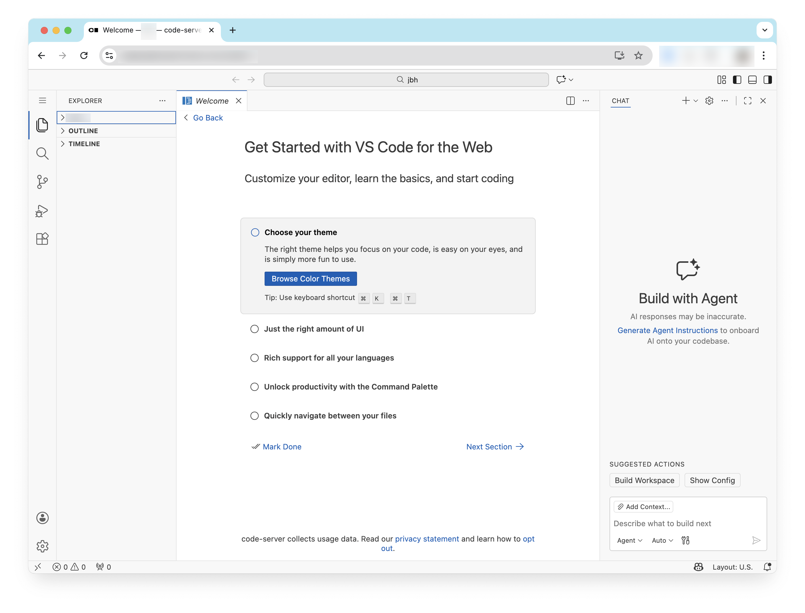
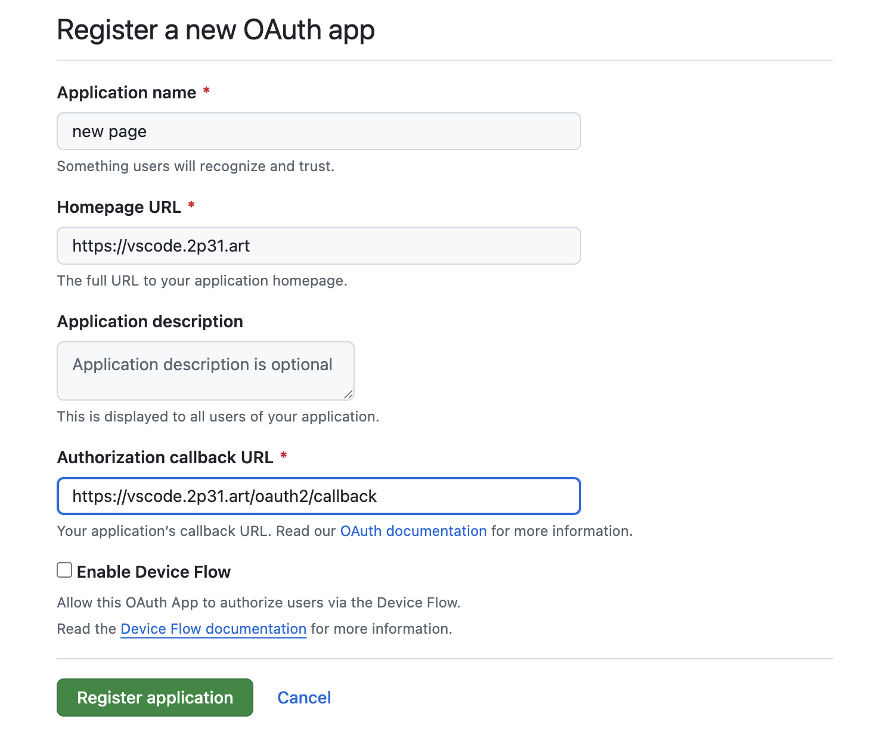
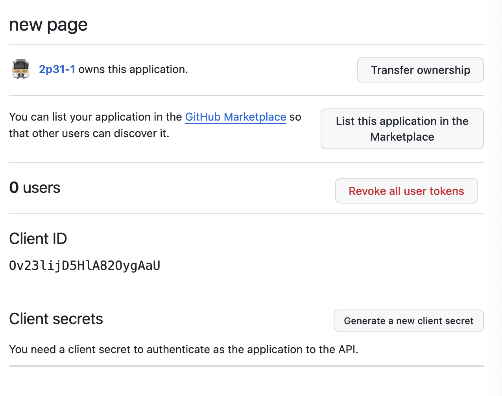
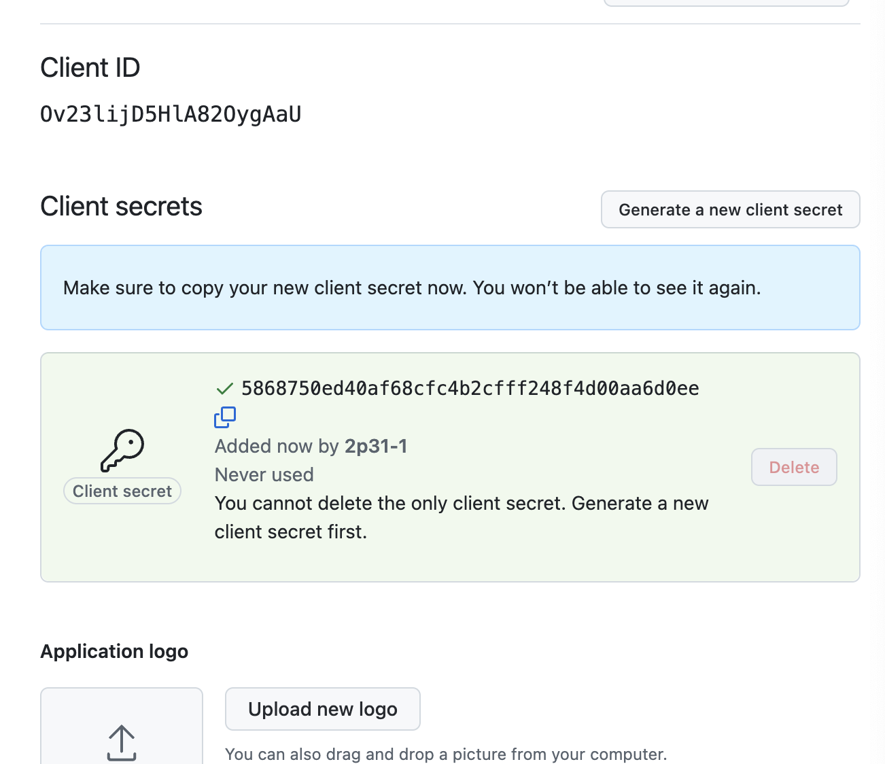

급하게 서버에 접속해야 할 때, 외부에서 셸이 필요할 때, 로컬 네트워크에서 일부 아웃바운드 포트가 막혀 있을 때 사용하고자, vscode를 서버에 설치했다.
해당 서버는 현재 https 포트에서 나가는 서비스가 존재하고 있는 상태이다. 단순히 리눅스나 컴퓨팅 사용, 프로젝트 개발 뿐 아니라 현재 운영중인 서버의 관리나 문제 확인, 수정의 역할도 겸하기 위해 Docker가 아닌 시스템에서 데몬으로 vscode 서버를 띄우기로 했다.

설치 대상이 된 vscode의 웹 IDE는 [coder사의 code-server](https://github.com/coder/code-server). 많은 사용자가 존재하고, vscode에서 크게 바뀌지 않은 사용성을 보여주는 것 같아 선택했다.

## code-server 설치
[github repository](https://github.com/coder/code-server)에 적힌 script를 사용해 설치하고, 스크립트가 내놓는 결과와 같이 시스템에 서비스를 등록하면 된다.
```bash
curl -fsSL https://code-server.dev/install.sh | sh
sudo systemctl enable --now code-server@$USER
```

서버는 자동으로 시작되고, 작동 여부를 확인할 수 있다.
```bash
sudo systemctl status code-server@$USER
```

```
● code-server@XXX.service - code-server
     Loaded: loaded (/lib/systemd/system/code-server@.service; enabled; vendor >
     Active: active (running)
   Main PID: XXX (node)
      Tasks: 107 (limit: 28686)
     Memory: 2.7G
     ...
```

### code-server 설정
정상적으로 `code-server`가 시작되면 `~/.config/code-server/config.yaml` 에 설정 파일이 자동 생성된다. 해당 파일을 다음과 같이 변경한다. `이 글에서는 9001포트를 사용한다`

```yaml
bind-addr: 0.0.0.0:9001
auth: none
password: XXX
cert: false
```

설정을 적용하기 위해 재시작한다.
```bash
sudo systemctl status code-server@$USER
```

9001포트에 http로 서빙이 되는지를 확인하기 위해, Visual Studio Code 등으로 원격 접속한 상태라면 9001번 포트를 사용해 `http://localhost:9001`로 문제 없이 접속이 가능한지 확인한다.
외부에서 9001번 포트로 접근할 수 없도록 보안 그룹이나 iptables 등을 제대로 설정해야 한다.

## oauth2-proxy 설치
[oauth2-proxy](https://github.com/oauth2-proxy/oauth2-proxy)는 Google, github 등 다양한 OAuth2 로그인 방법을 서버에 쉽게 적용할 수 있는 프로그램이다. 이 자체만으로도 리버스 프록시를 제공하고, 자체적으로도 로그인 검증 서비스를 제공한다. go로 직접 빌드 가능하고, 바이너리도 제공한다.. 바이너리는 [여기](https://github.com/oauth2-proxy/oauth2-proxy/releases/tag/v7.13.0)에서 받으면 된다.
Docker로도 사용할 수 있지만, 서비스가 크지 않고, 바이너리 자체만으로도 가볍게 실행 가능하기 때문에 바이너리를 다운로드받아 진행한다.

다음의 명령어를 사용해서 알맞는 바이너리를 다운로드 받으면 된다.
```bash
uname -s
uname -m
```

현재 장치가 Linux/aarch64 이기 때문에, linux-arm64 빌드를 사용한다.
```bash
wget https://github.com/oauth2-proxy/oauth2-proxy/releases/download/v7.13.0/oauth2-proxy-v7.13.0.linux-arm64.tar.gz
tar -xzf oauth2-proxy-v7.13.0.linux-arm64.tar.gz
sudo cp oauth2-proxy-v7.13.0.linux-arm64/oauth-proxy2 /usr/bin
rm -rf oauth2-proxy-v7.13.0.linux-arm64 oauth2-proxy-v7.13.0.linux-arm64.tar.gz
oauth2-proxy --version
```

나는 이 글을 쓰기 전 go 빌드 툴을 설치하고 직접 go로 빌드해서 다음과 같은 버전이 나왔다.
```
oauth2-proxy undefined (built with go1.25.5)
```

### oauth2-proxy 설정

oauth2-proxy는 nginx 없이도 자체적으로 reverse proxy를 제공하고, 내부 서비스에 인증된 사용자들을 보내고, 인증되지 않은 사용자들은 로그인을 하도록 유도할 수 있게 되어있다. 현재 설치하고자 하는 장치에는 code-server 이외에도 각종 웹 서버와 게임 서버 등이 여러 개 작동하고 있어서 oauth2-proxy는 신분을 인증하는데만 사용하고 nginx를 주 리버스 프록시로 사용한다.

설정 방법은 [원문](https://oauth2-proxy.github.io/oauth2-proxy/installation/)에서도 자세하게 확인 가능하다. 아래 내용은 systemd를 사용하는 방법, config 파일을 사용해 작동시키는 방법에 대한 매뉴얼과 유사하다.

#### Github 연동
다른 인증 수단 중에서도 어차피 visual studio code를 원격으로 실행하게 되는 경우라면 github에 로그인은 하지 않을까, 라는 생각으로, github 로그인 연동을 추가하였다.

- `[HOST]`: 외부에 보여지게 될 도메인 주소
- `[GITHUB_CLIENT_ID]`, `[GITHUB_CLIENT_SECRET]`: 다음 과정으로 발급받을 수 있다.
1. [깃허브 OAuth Apps](https://github.com/settings/developers) 페이지에서 `New OAuth App`을 누른다.
2. 페이지에 관한 정보 입력
	
	- Application name: 자유롭게 작성한다.
	- Homepage URL: 도메인 주소를 입력한다. (`https://[HOST]`)
	- Authorization callback URL: OAUTH2_PROXY_REDIRECT_URL 값과 같은 값을 작성한다. (`https://[HOST]/oauth2/callback`)
3. Client ID를 복사해서 `[GITHUB_CLIENT_ID]` 값에 입력한다. Generate a new client secret를 눌러 secret을 발급받는다.
   
4. 나온 secret 값을 [GITHUB_CLIENT_SECRET] 값에 입력한다.
   
- `[COOKIE_SECRET_BASE64]`: OAuth가 토큰을 인증하기 위한 Secret 키이다. 임의의 값을 입력하면 된다.
```bash
dd if=/dev/urandom bs=32 count=1 2>/dev/null | base64 | tr -d -- '\n' | tr -- '+/' '-_' ; echo
```

실행 후 나온 값을 붙여 넣으면 된다.

위에서 작성한 값들은 아래에서 수정해 붙여넣는다.
```bash
sudo mkdir -p /etc/oauth2-proxy
touch /etc/oauth2-proxy/oauth2-proxy.env
```

로 `/etc/oauth2-proxy/oauth2-proxy.env` 환경 파일을 만들어주고, 다음 내용을 입력한다. (입력하기 전에 메모장에 집어넣고 `[]`로 감싸진 환경 변수 값들을 수정할 필요가 있다. 여기에서는 4180 포트를 사용한다.

- `[GITHUB_ID]`, `[GITHUB_ORG]`: 접근을 허용하고자 하는 ID와 조직명을 집어넣는다.

`/etc/oauth2-proxy/oauth2-proxy.env` 
```
OAUTH2_PROXY_PROVIDER=github
OAUTH2_PROXY_HTTP_ADDRESS=127.0.0.1:4180

OAUTH2_PROXY_CLIENT_ID=[GITHUB_CLIENT_ID]
OAUTH2_PROXY_CLIENT_SECRET=[GITHUB_CLIENT_SECRET]
OAUTH2_PROXY_COOKIE_SECRET=[COOKIE_SECRET_BASE64]

OAUTH2_PROXY_REDIRECT_URL=https://[HOST]/oauth2/callback
OAUTH2_PROXY_COOKIE_SECURE=true
OAUTH2_PROXY_COOKIE_SAMESITE=lax

OAUTH2_PROXY_EMAIL_DOMAINS=*
OAUTH2_PROXY_SET_XAUTHREQUEST=true
OAUTH2_PROXY_UPSTREAMS=static://200

OAUTH2_PROXY_GITHUB_ORG="[GITHUB_ORG]"
OAUTH2_PROXY_GITHUB_USERS="[GITHUB_ID]"
```
### systemd 서비스 등록
```bash
sudo useradd --system --home /var/lib/oauth2-proxy --shell /usr/sbin/nologin oauth2-proxy || true
sudo chown root:oauth2-proxy /etc/oauth2-proxy/oauth2-proxy.env
sudo chmod 600 /etc/oauth2-proxy/oauth2-proxy.env
touch /etc/systemd/system/oauth2-proxy.service
```

`/etc/systemd/system/oauth2-proxy.service`
```ini
[Unit]
Description=OAuth2 Proxy (GitHub) for code-server
After=network.target

[Service]
Type=simple
User=oauth2-proxy
Group=oauth2-proxy

EnvironmentFile=/etc/oauth2-proxy/oauth2-proxy.env
ExecStart=/usr/bin/oauth2-proxy

Restart=on-failure
RestartSec=3

NoNewPrivileges=true
PrivateTmp=true
ProtectSystem=strict
ProtectHome=true
ReadWritePaths=/var/lib/oauth2-proxy

[Install]
WantedBy=multi-user.target
```

```bash
sudo systemctl daemon-reload
sudo systemctl enable --now oauth2-proxy
```

이 상태에서 `http://localhost:4180/oauth2/sign_in`에 접속이 가능하면 oauth2-proxy가 정상적으로 설치된 것이다.

### nginx 설정

원래 있던 타 웹 서버가 letsencrypt로 자동으로 ssl 인증서를 갱신하는 구조를 가지고 있었다. 비슷한 방법으로 https 접속을 위해 인증서를 설정해 주었다. certbot과 letsencrypt, 인증서 자동갱신이 선행되어야 한다.

여기서는 간략하게 certbot을 사용한 인증서 갱신에 대해 다룬다. DNS에서 A 레코드가 현재 서버의 ip를 가리키도록 하고, 80, 443 포트는 외부에 개방되어야 한다.

```bash
sudo certbot --nginx -d [HOST]
```

nginx 리버스 프록시를 설정한다. 다양한 도메인이 현재 서버를 가리키고 있으므로 `[HOST]`로 들어오는 접근만 oauth-proxy와 vscode로 라우팅하도록 한다.

아래 설정은 `[HOST]`의 값을 바꿀 필요가 있다.

`/etc/nginx/sites-available/vscode`, `/etc/nginx/sites-enabled/vscode`
```
server {
    listen 80;
    server_name [HOST];
    location / {
        return 301 https://$host$request_uri;
    }
}

server {
      listen 443 ssl http2;
      listen [::]:443 ssl http2;
      server_name [HOST];

      ssl_certificate /etc/letsencrypt/live/[HOST]/fullchain.pem;
      ssl_certificate_key /etc/letsencrypt/live/[HOST]/privkey.pem;

        location /oauth2/ {
    proxy_pass http://127.0.0.1:4180; # oauth-proxy가 있는 포트 주소를 입력한다.
    proxy_set_header Host $host;
    proxy_set_header X-Real-IP $remote_addr;
    proxy_set_header X-Forwarded-Proto $scheme;
    proxy_set_header X-Forwarded-For $proxy_add_x_forwarded_for;

    # 로그인 후 원래 URL로 복귀
    proxy_set_header X-Auth-Request-Redirect $request_uri;
  }

    # auth_request가 호출할 인증 체크
    location = /oauth2/auth {
        proxy_pass http://127.0.0.1:4180/oauth2/auth; # oauth-proxy가 있는 포트 주소를 입력한다.
        proxy_set_header Host $host;
        proxy_set_header X-Real-IP $remote_addr;
        proxy_set_header X-Forwarded-Proto $scheme;
        proxy_set_header X-Forwarded-For $proxy_add_x_forwarded_for;

        proxy_set_header Content-Length "";
        proxy_pass_request_body off;
    }
    # 나머지는 기존 HTTPS 백엔드로
    location / {
        auth_request /oauth2/auth;
        error_page 401 = /oauth2/sign_in;

        auth_request_set $user  $upstream_http_x_auth_request_user;
        auth_request_set $email $upstream_http_x_auth_request_email;

        proxy_pass http://localhost:9001; # [PORT] 입력
        proxy_redirect default;
        proxy_http_version 1.1;

        proxy_set_header Upgrade $http_upgrade;
        proxy_set_header Connection $connection_upgrade;

        proxy_set_header Host $http_host;
        proxy_set_header X-Real-IP $remote_addr;
        proxy_set_header X-Forwarded-For $proxy_add_x_forwarded_for;
        proxy_set_header X-Forwarded-Proto $scheme;

        client_max_body_size       10m;
        client_body_buffer_size    128k;

        proxy_connect_timeout      90;
        proxy_send_timeout         3600;
        proxy_read_timeout         3600;
        proxy_request_buffering    off;
    }
}
```

1. 접속을 시도하면 /oauth2/auth 엔드포인트에서 쿠키가 유효한지 확인한다. 올바른 쿠키가 없으면 401을 반환하고, 401을 반환하는 경우 /oauth2/sign_in 으로 리다이렉션한다.
2. 한번 oauth2-proxy를 사용해 github로 로그인하면 현재 도메인에 대해 쿠키가 설정된다.
3. 매 접속 시마다 쿠키의 토큰을 secret으로 검사해서 문제가 없으면 이동하려는 경로를 9001 포트로부터 가져와준다.

현재 설정은 로그인 가능한 대상을 제한하고 있지만, 다른 목적의 서버를 구현한다면 로그인 대상 제한을 풀고 쿠키 값을 사용해 `/oauth2/userinfo` 를 호출하여 일반 사용자의 OAuth2 로그인도 구현 가능하다. (이쪽이 일반적인 oauth2-proxy의 사용 방법이다.)

code-server에서는 WebSocket을 사용하기 때문에 다음 설정이 포함되었는데, 문제 없이 적용되기 위해서는 `/etc/nginx/nginx.conf`도 설정되어야 한다.
```
proxy_set_header Upgrade $http_upgrade;
proxy_set_header Connection $connection_upgrade;
```

http를 찾아 내부에 다음의 4줄을 추가한다.
```
map $http_upgrade $connection_upgrade {
	default upgrade;
	'' close;
}
```

적용하면 다음과 같은 모양이다.

`/etc/nginx/nginx.conf`
```
...


http {
	map $http_upgrade $connection_upgrade {
		default upgrade;
		'' close;
	}

...
```

헤더 값을 reverse proxy 내부의 서버에 전송하기 위한 것으로, Upgrade, Connection 헤더를 code-server 에 전달하기 위해 두 줄의 설정이 포함되었다.
그러나 매번 헤더를 설정하면 일반 HTTP 요청에도 Upgrade 헤더가 들어가는 문제가 생기기 때문에 매핑함수(map) 로 다른 값으로 바꿔준다.
일반 HTTP 요청에서 Upgrade 헤더가 아무것도 오지 않더라도, 그대로 백엔드에 전달하게 되면,
```
Connection: keep-alive
Upgrade:
```
가 전달되는데, `Upgrade`헤더가 code-server에 전달되어 Upgrade할 연결이 없는데 헤더가 주어지는 문제가 생긴다. 이 경우에 `close`를 전달하기 위해 위 매핑함수를 만든 것이고, 결과적으로 websocket 연결인 경우 헤더가
```
Upgrade: websocket
Connection: upgrade
```
일반 HTTP 연결인경우
```
Connection: keep-alive (혹은 HTTP 헤더에서 주어지는 Connection 헤더 value)
Upgrade: close
```
헤더가 전달되어 명시적으로 Upgrade하지 않음을 전달할 수 있다.

수정이 완료되면
```bash
sudo nginx -t
```
로 설정이 잘못되지 않았는지 확인한다.

```
sudo nginx -t && sudo systemctl reload nginx
```
으로 nginx 설정을 반영하면 된다.


## 결론
nginx, oauth2-proxy로 특정 도메인에 대해서 접근 가능한 사용자를 한정하고, code-server를 띄워서 해당 도메인으로 github oauth 로그인을 하면 code ide 환경에 접근할 수 있도록 구성했다.

현재와 같은 구조는 웹을 통해 곧바로 서버 터미널로 접근할 수 있어 어디에서나 사용하는 웹 IDE로써 안전하다고 느껴지지 않는 느낌이 있다.
docker로 code-server를 유저별로 띄워 놓고 접근이 필요한 디렉토리만 해당 code-server 컨테이너에 마운트하고 터미널 접근이 반드시 필요하다면 code-server 내 터미널로 ssh를 사용해 접근하는 것이 더욱 안전할 것이라고 생각한다.

#oauth2-proxy #nginx #vscode #coder #code-server